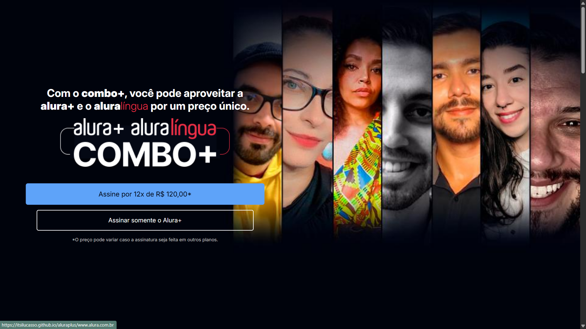
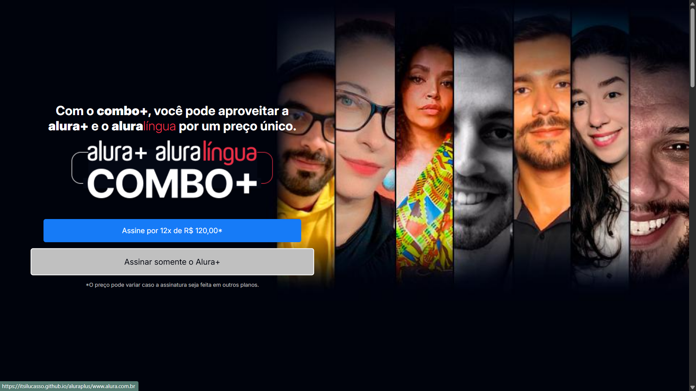
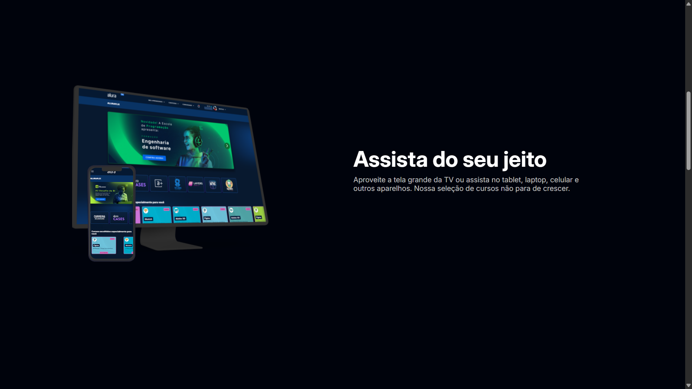
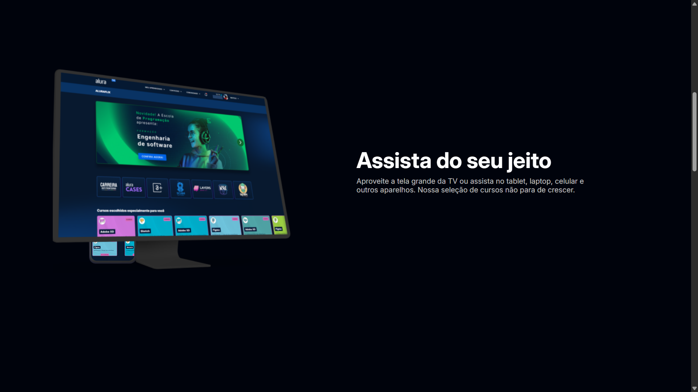
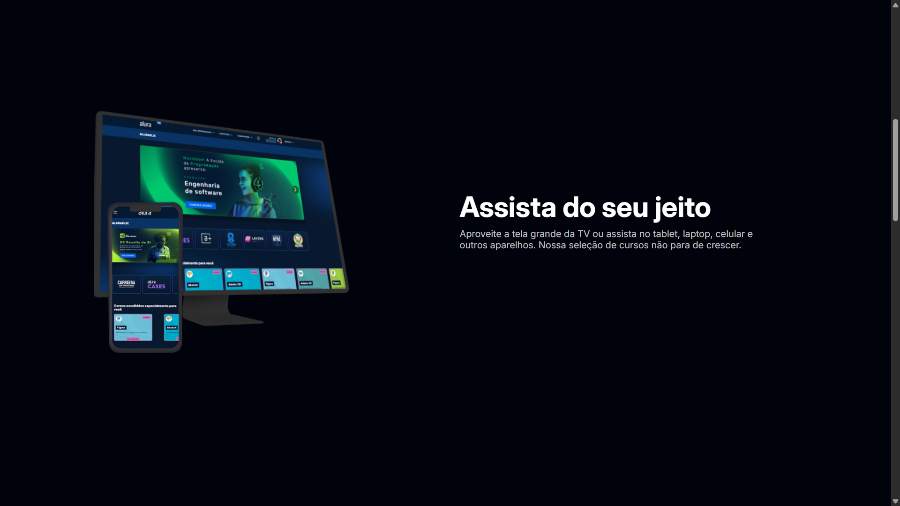
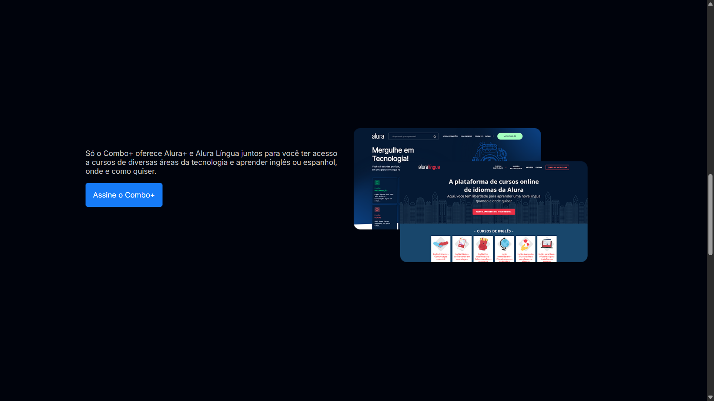
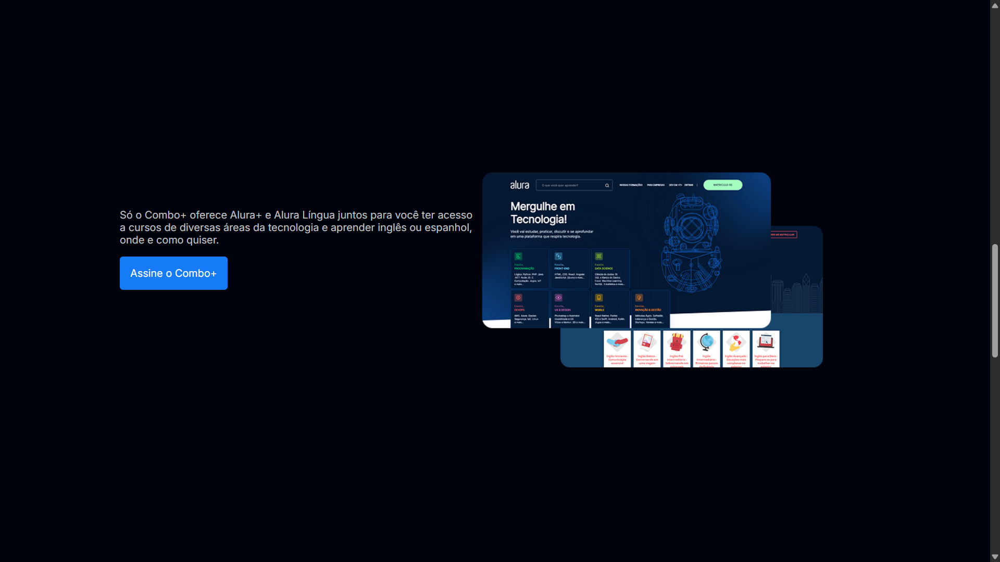

# *Olá!* 👋🏻

> ***AluraPlus***
> 
*foi uma proposta de desenvolvimento de aprendizagem inicial em HTML e CSS. A ideia foi desenvolver um site para promoção de valores exclusivos para ofertar aos assinantes o **"Combo+"**, o pacote para assinatura da Alura com Aluralíngua por um preço atraente. A proposta desenvolvida pelos instrutores foi praticamente um site estático, até porque o desenvolvimento é para iniciantes, então não convém tornar mais complexo para quem está aprendendo as ferramentas pela possibilidade de dificultar e retardar de alguma forma o processo de aprendizagem. Ao final dos cursos os intrutores até encorajam as pessoas para que deem um toque de criatividade no desenvolvimento, mas sem entrar muito a fundo. Portanto, vou deixar alguns prints do desenvolvimento do site e destaco que tudo que foge do estático - sem movimento, sem mudança de cor e sem desmembramentos - foi proposto por mim mesmo para trazer, hipotéticamente, uma experiência diferente para quem quer viesse usar o site.*
#

#

#

>***imagem estática sem desmembramento e sem destaque no hover proposto no projeto***

 

#

>***monitor desmembrado e em destaque com hover não proposto no projeto***

#

>***celular desmembrado e em destaque com hover não proposto no projeto***

#

>***imagem estática sem qualquer efeito proposto no projeto***

#

>***imagens desmembradas com efeito de destaque de acordo com o mouse, trazendo a do segundo plano, por exemplo, para a frente, não proposto no projeto***

#

  
  

  
  
  

